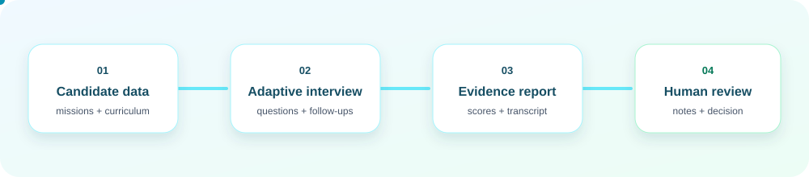

<div align="center">

# ProbeIQ

<a href="https://readme-typing-svg.demolab.com?font=Fira+Code&weight=600&size=22&pause=1200&color=0891B2&center=true&vCenter=true&width=620&lines=Interview+intelligence+for+hiring+teams;Grounded+questions.+Evidence-backed+reports.;Human+review+where+it+matters.;Live+at+frontend-swart-nu-76.vercel.app">
  
</a>

[](https://fastapi.tiangolo.com/)
[](https://nextjs.org/)
[](https://openrouter.ai/)
[](https://frontend-swart-nu-76.vercel.app)
[](#development)

</div>

ProbeIQ runs adaptive technical interviews using a candidate's actual project and curriculum history. It turns the conversation into a structured assessment, then gives recruiters a durable review workspace for notes and decisions.

## Live Demo

<p align="center">
  <a href="https://frontend-swart-nu-76.vercel.app">
    
  </a>
</p>

| Frontend (Vercel) | Backend (Render) |
| --- | --- |
| <a href="https://frontend-swart-nu-76.vercel.app"></a> [frontend-swart-nu-76.vercel.app](https://frontend-swart-nu-76.vercel.app) | [probeiq-api.onrender.com](https://probeiq-api.onrender.com) |
| Next.js app — run a full interview live | FastAPI — [`/health`](https://probeiq-api.onrender.com/health) |

> Free-tier hosting: the backend sleeps after idle, so the first request may take ~30–60s to spin up.

## What It Does

| Interview | Assessment | Recruiter workflow |
| --- | --- | --- |
| Builds questions from real candidate missions and tools | Scores answer depth by topic in real time | Stores interview history in SQLite |
| Adapts the interviewer for junior, mid, and senior candidates | Produces strengths, gaps, and concrete next steps | Supports transcript review, notes, and hiring decisions |
| Lets candidates pause or skip a topic | Includes printable, evidence-oriented feedback | Filters and compares completed sessions |

## Product Flow

<p align="center">
  
</p>

```text
Candidate data + curriculum
            |
            v
  Adaptive interview planner
            |
            v
  Live conversation + topic scoring
            |
            v
 Feedback report + recruiter review
```

## Stack

- Frontend: Next.js 15, React 18, Tailwind CSS
- Backend: FastAPI, Pydantic, SQLite
- LLM: OpenRouter with Ollama and deterministic offline fallbacks
- Storage: `probeiq.db` for interview history and reviewer decisions

## Quick Start

### 1. Configure the backend

```bash
python -m pip install -r requirements.txt
```

Create `.env` from `.env.example` and set an OpenRouter key:

```env
OPENROUTER_API_KEY=sk-or-v1-...
LLM_MODEL=openai/gpt-4o-mini
```

Start the API:

```bash
python main.py
```

The backend is available at `http://localhost:8000`.

### 2. Start the frontend

```bash
cd frontend
npm install
npm run dev
```

On Windows PowerShell, use `npm.cmd run dev` if script execution is restricted.

Open `http://localhost:3000`.

The frontend proxies browser requests through `/backend`, so candidate loading stays same-origin and responsive.

## API

### Start an interview

`POST /api/interview`

```json
{
  "sessionId": "candidate-001",
  "candidate": { "member": { "name": "Alex" } },
  "settings": {
    "focus": "System design",
    "duration": "standard",
    "style": "balanced"
  }
}
```

### Continue an interview

`POST /api/interview`

```json
{
  "sessionId": "candidate-001",
  "message": "I chose pgvector because it kept our first release simple."
}
```

### Skip the current topic

`POST /api/interview`

```json
{ "sessionId": "candidate-001", "action": "skip" }
```

### Review interviews

| Method | Endpoint | Purpose |
| --- | --- | --- |
| `GET` | `/api/candidates` | Candidate picker data |
| `GET` | `/api/interviews` | Recruiter history |
| `GET` | `/api/interviews/{sessionId}` | Full report and transcript |
| `PATCH` | `/api/interviews/{sessionId}/review` | Save decision and reviewer note |
| `GET` | `/health` | Service health |

Example review request:

```json
{
  "decision": "Hire",
  "reviewerNote": "Strong retrieval trade-off reasoning. Validate production observability in the next round."
}
```

## LLM Fallbacks

ProbeIQ stays usable even when a provider is unavailable:

```text
OpenRouter -> Local Ollama -> Context-aware offline fallback
```

The fallback still references the current candidate and topic, so a failed provider does not devolve into repeated generic questions.

## Development

```bash
# Backend syntax check
python -m py_compile main.py session_store.py interviewer.py feedback.py

# Frontend production build
cd frontend
npm run build
```

## Project Map

```text
ProbeIQ/
  main.py                 FastAPI routes and interview lifecycle
  planner.py              Candidate mission and curriculum planning
  interviewer.py          Adaptive question generation and scoring
  feedback.py             Structured final assessment
  llm_client.py           OpenRouter, Ollama, and offline fallback client
  session_store.py        SQLite-backed interview history and review metadata
  frontend/app/           Landing, interview, feedback, and dashboard screens
```

## Data and Privacy

Candidate data comes from the local `candidates.json` file. Interviews and reviewer notes are stored locally in `probeiq.db`. Do not commit `.env` or `probeiq.db`.

---

<div align="center">
  Built for teams that want hiring evidence, not just interview transcripts.
</div>
```